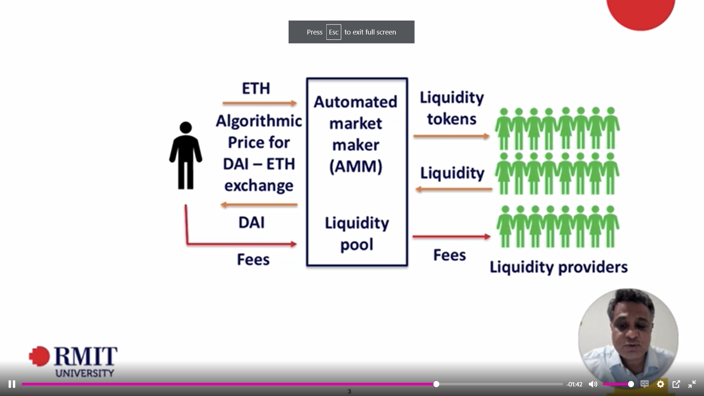

- We are trying to develop an application that allows the exchange of one form of tokens to another. Such an application is called a Decentralised Exchange applications.
- In this application we will be allowing users to convert their tokens from one form to another by not taking any fee as a platform but only costing the fee that is involved in exchange between the liquidity pool and the users.
- Things to keep in mind are:
    - Liquidity pool is a place where all types tokens exist. Liquidity pool consits of liquidity providers, they are people who put in equal amounts of 2 types of currencies that will be involved in the transaction. 
    - For putting in the liquidity, LProviders earn fees from every trade. This fee is fixed everytime. 

Liquidity pools are smart contracts that hold balances of two unique tokens and enforces rules around depositing and withdrawing them.

Liquidity Pools here act as [Automated Market Makers](./AMM.md). Since there is no centralized authority deciding the price of certain type of currency, the price is totally dependent on the mathematical formula which calculates the value of currencies based on the amount of type of currency present in the liquidity pool.

### What is Uniswap and why are we using it's protocols?

To develop this application we are using some of the protocols that are provided by a DEX called Uniswap. Uniswap is an automated liquidity protocol powered by a constant product formula and implemented in a system of non-upgradeable smart contracts on the Ethereum blockchain. It obviates the need for trusted intermediaries, prioritizing decentralization, censorship resistance, and security. Uniswap is open-source software.

Each Uniswap smart contract, or pair, manages a liquidity pool made up of reserves of two tokens involved in a transaction.

[More about Uniswap](./Uniswap.md)

Anyone can become a liquidity provider and contribute to the liquidity pool but that is beyond the scope of this application.

**This image shows how the app works BTS**

**How uniswap works**

### Can you use their smart contracts? Yes.
- We are doing so because it is tedious to build an ecosystem with such complex principles, concerning the security of currency exchange, functioning of liquidity pool, compiling and deploying of sub functionalities which are a very minute smart contracts that run along side the main smart contract. Since it is open source we can use protocols provided by uniswap as we are only going use a part of functionality provided by Uniswap inorder to develop our application.
The Uniswap ecosystem involves liquidity providers, traders. The job of
    - liquidity providers is to contribute tokens to the common liquidity pool
    - traders is to swap these tokens for another for a fixed fee of 0.30% fee which goes to liquidity providers

Since it is open source, and already involves pool of providers, we will be using their protocols inorder to develop an application where we can exchnage one form of token with another.

### Main goal of our application is
For end-users, to swap 
- a user picks an input token and an output token. They specify an input amount, and the protocol calculates how much of the output token they’ll receive. They then execute the swap with one click, receiving the output token in their wallet immediately.

### How are we building the application

- We are going to build it on the top of Uniswaps source code
- We will be using uniswap v2 core contract and uniswap v2 periphery contract to build our application, each of these contracts involves complex code ensures safety and security of exchange. For example,  Core contracts provide fundamental safety guarantees for all parties interacting with Uniswap. Periphery contracts interact with one or more core contracts but are not themselves part of the core.
- Since we are not going to implement the above mentioned action we will be using a software called CRANQ which is a  graphical and intutive IDE that is designed for discovery, and re-use of existing code and smart contracts.
- Cranq helps us abstract the most critical functionality from these smart contracts and use them in our application as we need it.
- Here it is also important to setup a crypto wallet, for testing we are using Metamask wallet, and are going to use a test network called Goreil. We will be using test eth for this project.
- Alchemy is a web3 development platform, we are going to compile and deploy our smart contracts using cranq but alchemy allows us to deploy these smart contracts to the blockchain

### Using Cranq to implement and get the necessary functionality from uniswap's smart contracts
- Initailly you have to complie and deploy the smart contracts, so we take router and factory compiler and deployer
- we can group related nodes
- after compiling and deploying factory and router contracts we have to add liquidity, without liquidity no exchange can work
- liquidity pools can be compared to banks, they should have pool of money for you to exchage with different currencies

### Why are we using ERC20 tokens
ERC20 tokens are tokens that use the standards of ERC20
They are fungible, not unique.
Since it is not possible for us to use real crypto token, we will be creating our own form of ERC20 tokens and then using them in exchanges.